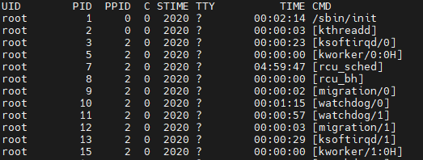
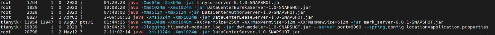
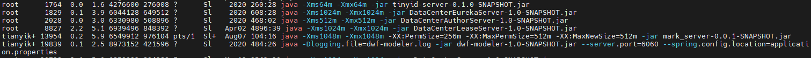

## 前言
实际生产中，总有一些基本的命令细节容易被遗忘。

特此记录一下一些基本的命令使用方式，用来学习和将来查阅。

----

## ps命令
ps命令是一个相当强大地Linux进程查看命令。

运用该命令可以确定有哪些进程正在运行和运行地状态、 进程是否结束、进程有没有僵死、哪些进程占用了过多地资源等等。

总之大部分信息均为可以通过执行该命令得到。

## 语法

### 选项参数

- -e 显示所有进程,环境变量

- -f 全格式

- -h 不显示标题

- -l 长格式

- -w 宽输出

- -a 显示终端上地所有进程,包括其他用户地进程

- -r 只显示正在运行地进程

- -x 显示没有控制终端地进程

- -u 以用户为主的来显示程序状况

### 常见用法

### ps -ef

该请求会显示PID

通常我们会使用管道过滤所有的显示，只关注重要信息。

### ps -ef | grep java

### ps -aux | grep java

